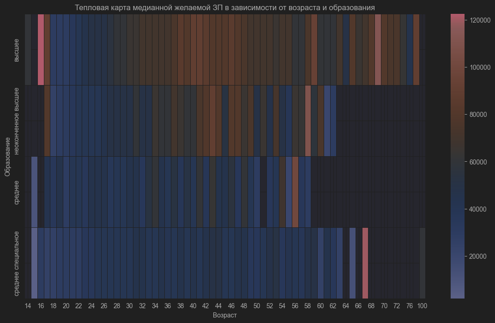

# Графики из "Исследования зависимостей в данных"
## Распределение возраста

## Распределение "Опыта работы (месяц)"

## Распределение ЗП

## Распределение с разбивкой по образованию

## Распределение по городам 

## Распределение по готовности к командировкам 

## Распределение по Возраст + Образование

## Распределение по опыт + образование

## Распределение по опыту + возраст + образование

## Распределение по опыту + город проживания

# Графики по очистке данных
## Таблица с полученными выбросами
 
